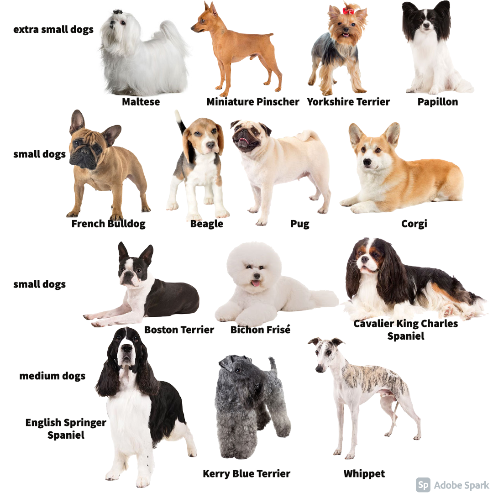
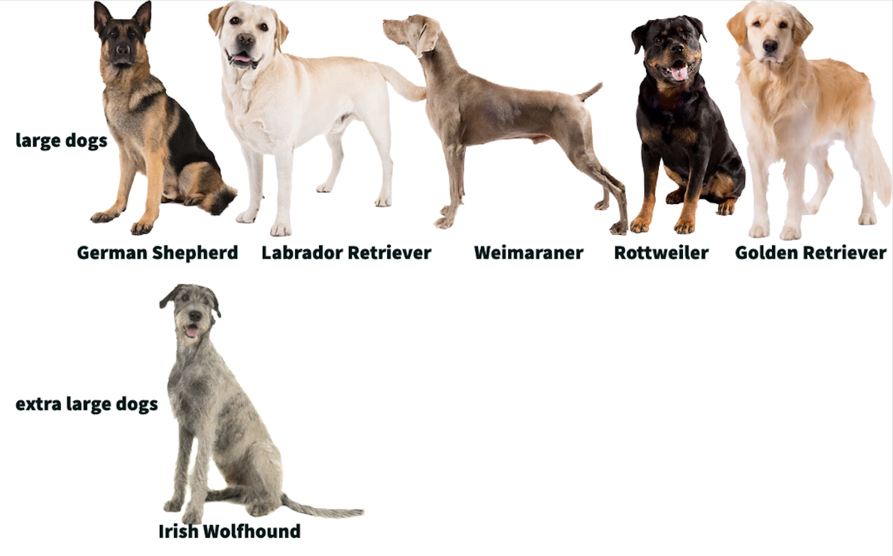

Introduction (40 points)

## Introduction

- 10 points for specific, measurable, and clear scientific question

### Scientific Question
#just add the 4
When examining dog breeds (canis lupus familiaris), will breeds of a similar size (e.g. Cocker Spaniel, English Cocker Spaniel) have more related genes and SNP's surrounding longevity than breeds of a different size (e.g.Doberman Pinscher,Miniature Pinscher)? Will these differences results in expression changes between breeds of different sizes?

*Note: I selected 4 genes closely associated with life span (IGF1, IGSF1, LCORL,and SMAD2). There are more genes involved than this. Breed size will be determined by the American Kennel Club (AKC). You can filter by all AKC recognized dog breeds by size on their website: https://www.akc.org/dog-breeds/.* 

- 10 points for background on the protein/gene/species of interest and where the data is sourced from

### Species of interest: Canis lupus familiaris and longevity
**Canis lupus familiaris** or the domestic dog, is the most phenotypically variable mammal on earth. This phenotypic variation is due to the intense selection that humans have imposed on dogs for the past XXX years that we have been coexisting together. But this wide phenotypic variation does more than make dogs cuter or more usable for humans. Variation in dog size in particular, has a huge effect on the longevity of the dog.  

### Gene of interest: LCORL
**LCORL** or Ligand Dependent Nuclear Receptor Corepressor Like. This gene encodes a transcription factor which functions in spermatogenesis. Polymorphisms of this gene are associated with changes in skeletal frame size and height. (https://www.genecards.org/cgi-bin/carddisp.pl?gene=LCORL)

### Gene of interest: IGF1
**IGF1** or Insulin Like Growth Factor 1. This gene encodes a protein similar to insulin (functionally and structurally) and is involved in mediating growth and development. (https://www.genecards.org/cgi-bin/carddisp.pl?gene=IGF1&keywords=IGF1)

### Gene of interest: IGSF1
**IGSF1** or Immunoglobulin Superfamily Member 1. This gene encodes a member of the immunoglobulin-like domain-containing superfamily. It contains various immunoglobulin-like domains thought to  regulate interactions between cells. (https://www.genecards.org/cgi-bin/carddisp.pl?gene=IGSF1&keywords=IGsF1)


### Gene of interest: SMAD2
**SMAD2** or SMAD Family Member 2. This gene encodes a protein that mediates signaling pathways. This includes the signal of the transforming growth factor (TGF)-beta. So SMAD2 indirectly regulates multiple cellular processes, such as cell proliferation, apoptosis, and differentiation. (https://www.genecards.org/cgi-bin/carddisp.pl?gene=SMAD2&keywords=SMAD2)

- 10 points for clear, specific, and measurable scientific hypothesis that is in the form of an if-then statement

### Scientific Hypothesis
If you examine canine breeds, then breeds of a similar size (e.g.Cocker Spaniel,English Cocker Spaniel) they will have more related SNPs and/or fragments of genes surrounding longevity than breeds of a different size (e.g.Doberman Pinscher,Miniature Pinscher). Changes in these SNPs and gene fragments will results in expressional changes between breeds. 

- 10 points for description of what analyses were done and how the data was downloaded for the project
## Analysis Performed:

### SNP analysis  

- Exploratory Data Analysis (EDA): Pie charts were created to show surface-level nucleotide distributions before size is taken into account. 
- Multiple Sequence Alignment: multiple sequence alignment (MSA) was performed on the SNPs and bordering sequences (+/- 5 bp). The results of these alignments was displayed with msaPrettyPrint()
- Clustering of MSA results, which were visualized as dendrograms 

### Gene analysis:
- Multiple Sequence Alignment-->Clustering: multiple sequence alignment (MSA) was performed on the genes these alignments were converted into something usable for forming a distance matrix and clustering with msaConvert(). Clustering was performed on this processed data and visualized as dendrograms. 

### Gene expression data:
- EDA: Scatter plots with regression lines were utilized see if expression, not changes in snps is the reason behind differences in longevity based on dog size. 
- Clustering of expression data, for genes studied in the prior two analysis steps. This data was kept on one excel sheet so the clustering of expression data by dog size could be represented in one dendrogram.

### Data Sourcing 

- Dog breed information (visualization and sizing): American Kennel Club (https://www.akc.org/) 
- Data downloads: 

- SNP and gene positionings for MSA and clustering: 
The ideal positions to perform our MSA and clustering at were determined by table 2 in Plassais' 2019 paper on whole genome sequence analysis on canines (https://www.nature.com/articles/s41467-019-09373-w/tables/2#ref-CR35). this table identifies the regions for each gene which account for the most variation. In the cases where the noted region was larger than the gene itself, I instead used the gene coordinates given by NCBI. We now have coordinated to perform our MSA alignment on, but no sequences. How to obtain these sequences is explained below.

- NCBI dog reference genomes for MSA and clustering:
First search up your gene of interest + "dog" (Example search for IGSF1 https://www.ncbi.nlm.nih.gov/gene/?term=IGSF1+dog). Select the relevant result. Under "Genomic regions, transcripts, and products" will be the 6 possible reference genomes. Select the reference genome of interest from the drop down menu and then select "FASTA" from the "Go to nucleotide" menu. Once you are viewing the reference sequence, change "Change region shown" to "Selected region" and enter your coordinates of choice. "Update view" must then be selected for this change to take place. Once the proper region is visualized, you can download this sequence to your local machine with "Send to", "complete record", and your file extension of choice (I used .fasta). 

- Gene expression data for clustering:
This gene expression data was extracted from the "Source Data" file from  Plassais' 2019 paper on whole genome sequence analysis on canines (https://www.nature.com/articles/s41467-019-09373-w/tables/2#ref-CR35). The expression is on the S4-S6 sheet. I removed the genes that I did not examine during prior steps. I then shifted the organization of the to better work for clustering (eg made the dog breed the row names and added expression results as column data making a dataframe with fewer rows and more columns), altering no numbers in the process. Since the breed names were listed without size data, I manually added in each breeds AKC size designation. This labeling makes interpreting our dendrograms much simpler down the line. 

- 25 points for definition of each of the packages loaded 
- 5 points for correctly loading all of the packages needed

### Package definitions
Before running our code numerous packages must be loaded in, below is a short summary of their general purpose and their purpose in the scope of my Project 2

**Check if needed**1) BiocManager:. For the purposes of my project, BiocManager is used to read in fasta files as DNAstringsets or AAstringsets.

2) readxl: A package to import excel files into R. For the purposes of my project, readxl is used to read in excel data with only one sheet.

3) xlsx: A package to import excel files into R. For the purposes of my project, xlsx is used to read in multi-sheet excel data.

4) msa: A package containing an interface for three multiple sequence alignment algorithms (CLUSTALW, CLUSTALOmega, and MUSCLE). For the purposes of my project, msa is used to perform multiple sequence alignment on our genes and SNPs of interest and visualization of these resulting alignments

5) tinytex: A custom LaTeX distribution for R. For the purposes of my project, tinytex is used for my msaprettyprint output. 

6) ggplot2: A system to create graphics declaratively or piece-by-piece, this allows for a great amount of customization. For the purposes of my project, ggplot is used to visualize a lot of my exploratory data analysis (breakdown of dog populations and expression data)

7) DECIPHER:. For the purposes of my project, DECIPHER is used to cluster dna sequences and form their resutlting dendrograms 

8) dendextend: A package which extends the functionality of dendrogram objects in R through tree vs. tree comparisons and extensive graphical customization of dendrograms. For the purposes of my project dendextend is used to fine tune my dendrograms (color by cluster group, prevent breed names being cut off, control branch height, adding titles). 
```{r}
#for reading in fasta files
#library("BiocManager")
#for reading in single sheet excel files
library("readxl")
#for reading in multi-sheet excel files
library("xlsx") 
#for multiple sequence alignment 
library("msa")
#for msa pretty print 
library("tinytex")

#visualization of results 
library("ggplot2")
#for clustering of DNA seqs 
library("DECIPHER")
#for cleaning up dendograms
library('dendextend')
```

First we will be performing MSA and clustering with various sequence data (SNPS and gene fragments). Unfortunately, the scope of this data is limited to the 5 breeds shown below, and heavily weighs our analysis towards larger dogs. 
```{r, echo=F}
knitr::include_graphics("dog/My_Post1.jpg")
```

Function definitions 

```{r}
#global variable, used to read in msa alignment pdfs
alignment_name<<-""

myColors <- c("antiquewhite4", " coral3", "darkgoldenrod4","darkcyan", "darkorchid4")

#notebook functions

#mult_alignments: align fasta depending on inputs, returns msaprettyprint alignment or plaintext alignment. 
#file_name: fasta file to be read in 
#fasta_names: names to display for prettyprint alignment, "names" in file_name files are entire paragraphs 
#big_aln: determines if msaprettyprint is run (True=run and return pdf name for display by knitr, False=return alignment as is). This is done because msaprettyprint cannot handle our larger sequences.
#dna_set: determines how the fasta data is read in (True=DNA, False=Amino Acid) this speeds up alignments of larger sequences
mult_alignments<-function(file_name,fasta_names,name,big_aln=FALSE,dna_set=TRUE){
  
  #read in fasta for all dogs
  #use DNA for small files 
  if(dna_set=="TRUE"){
  #string_set: local variable that holds our fasta data as DNAStringSets. 
  #The fasta data is the sequence data for the 6 reference sequence breeds in whatever our gene or SNP of interest is
  string_set<-readDNAStringSet(file=file_name,use.names=FALSE)
  }
  #AA for large files
  else{
      #string_set: local variable that holds our fasta data as AAStringSets 
      string_set<-readAAStringSet(file=file_name,use.names=FALSE)

  }
  
  #update names for pretty print display from  list which contains our shortened 
  #sequences names read in from fasta_names, a .txt file with no headers and 
  #variables separated by new lines
  names(string_set)<-read.table(fasta_names, header = FALSE, sep = "\n")[["V1"]]
  
  #alignment: local variable which stores the msa of our aligned, named sequences,
  #we want to maintain our input order, which is ordered by breed size.
  alignment<-msa(string_set,order="input")
  #if seq cant be displayed with msa pretty print, return
  if(big_aln==TRUE){
    return(alignment)
  }
  #update global variable so multiple pretty print runs don't overrun each other. Combine the strings of the name of the gene inputted with the file type, ".pdf". The gsub call ensures there's no unwanted spaces between out gene name and the file extension
  alignment_name<<-gsub(" ", "", paste(name,".pdf"), fixed = TRUE)
  
#return pretty alignment, as a pdf. file saves our results to the desired, named pdf. output="pdf": determines our file extension, showNames="right": places our sequence names (dog breed + size) to the right of the aligned sequences, showLogo="top": places a DNA logo on the top of our alignment, askForOverwrite=False overwrites old files with the same name without warnings, showNumbering =none removes unnecessary numerbing from alignment. paperWidth and paperHeight control output sizing 
  msaPrettyPrint(alignment, file=alignment_name,output="pdf",
                 showNames="right",showLogo="top",askForOverwrite=FALSE,
                 showNumbering="none",paperWidth=6,paperHeight=3)
#return 
return(alignment_name)
}
#create figure with white background, no gridline and only ticks along x and y 
#axis. Designed for barplot displays but should work with many other forms of ggplots
#fig: ggplot to be altered
tune_figure<-function(fig){
  #builds changes based off of theme_minimal(). 
  return(fig+theme_minimal()+theme(
    #removes background color
    plot.background = element_blank(),
    #removes gridding on plot 
    panel.grid.major = element_blank(),
    panel.grid.minor = element_blank(),
    #removes x and y axis lines, keeping the ticks in place.
    panel.border = element_blank()))
}
#create dendogram based on fasta files, names of items clustered in fasta_names
#fasta_path: path to fasta file 
#fasta_names: path to names to display on dendrogram
create_dendrogram<-function(fasta_path, fasta_names, fig_title){
  #grab DNA info from collated file
  #dna is a local variable that contains the read in fasta file as a DNAStringSet. 
  #The names are not read in due to their excessive length 
  dna <- string_set<-readDNAStringSet(file=fasta_path,use.names=FALSE)
  #update DNAStringSet sequences to have the shorter names read in from the 
  #file, fasta_names, read in as a list
  names(dna)=read.table(fasta_names, header = FALSE, sep = "\n")[["V1"]]
  #create local variable d1 which forms a distance matrix for clustering 
  #based off our named DNA sequence data
  d1 <- DistanceMatrix(dna, type="dist")
  #form dendogram with IdClusters the DNA specific package 
  dendogram<-IdClusters(d1, method="complete", cutoff=0.05, showPlot=FALSE,
                        type="dendrogram")
  #fix names being cut-off
  nodePar <- list(lab.cex = 0.6, pch = c(NA, 19), 
                cex = 0.7, col = "black")
#plot results 
plot(as.dendrogram(dendogram), ylab = "Height", nodePar =nodePar,main=fig_title)
  return(as.dendrogram(dendogram))
}
```
EDA of Sequence data 
```{r}
#visualize size breakdown of dogs
snps<-read_excel("dog snps.xlsx")
#fix ordering of legend
snps$Name <- factor(snps$Name, levels = c("Basenji", "Boxer", "German_Shepherd","Labrador_retriever","Great_Dane"))
p<-ggplot(data = snps, aes(size))+scale_x_discrete(limits = c("S","L","XL"))+geom_bar(aes(fill = Name))+scale_fill_manual(values = c("deepskyblue4","brown2","brown","brown4","darkseagreen4"))
tune_figure(p)
```


LCORL Sequence Analysis 
SNP scatterplot, see if any obvious trends
```{r}
pies<-read_excel("dog snps.xlsx",sheet="pie")
pie(table(pies$lcorl),col=myColors)

```

LCORL alignment, see if size-grouping is obvious
```{r}
#LCORL call multiple sequence alignment helper function. since LCORL_file.txt is a smaller file, 
alignment<-mult_alignments("fasta/LCORL_file.txt","fasta/names.txt","LCORL")
print(alignment_name)
```
```{r, out.width="600px",echo=F}
#view pdf
knitr::include_graphics(alignment_name)
```

LCORL clusters, see if group by dog size 
```{r}
#Cluster LCORL extended fragment 
create_dendrogram("fasta/LCORL_file.txt", "fasta/names.txt", "LCORL Extended Fragment Dendogram")
#may not be pure breeds
#try and figure out if regions are correct 
```

IGF1 ANALYSIS
EDA of IGF1 SNP, see if are any obvious trendds 
```{r}
pies<-read_excel("dog snps.xlsx",sheet="pie")
pie(table(pies$igf1),col=myColors)

```

IGF1 Alignment, see if size-grouping is obvious
```{r}
#IGF1 CALL
alignment<-mult_alignments("fasta/igf1.fasta","fasta/igf1_names.txt","igf1")
```
```{r, out.width="600px",echo=F}
#view pdf
knitr::include_graphics(alignment_name)
```
http://www.sthda.com/english/wiki/beautiful-dendrogram-visualizations-in-r-5-must-known-methods-unsupervised-machine-learning#plot.dendrogram-function for look and non cut off stuff


IGF1 Clustering, see if size-grouping is obvious
```{r}
#Cluster IGF1 extended fragment 
create_dendrogram("fasta/igf1.fasta", "fasta/igf1_names.txt", "IGF1 Extended Fragment Dendogram")
```

IGSF1 ANALYSIS, add back in for final submit 


library(seqinr)
library(ape)

#takes too long to run, will add in final submission
igsf1<-mult_alignments("fasta/IGSF1.fasta","fasta/IGSF1_names.txt","IGSF1",TRUE,FALSE)
```
igsf1_aln <- msaConvert(igsf1, type="seqinr::alignment")
d <- dist.alignment(igsf1_aln, "identity")
dendogram<-IdClusters(d, method="complete", cutoff=0.05, showPlot=FALSE,type="dendrogram")
  #fix names being cut-off
  nodePar <- list(lab.cex = 0.6, pch = c(NA, 19), 
                cex = 0.7, col = "black")
#plot results 
plot(as.dendrogram(dendogram), ylab = "Height", nodePar =nodePar,main="igsf1")
```

The differences sequence-wise seems to be minor when looking at such a narrow scope and small subsection of dogs. Thankfully there is also expression data for the genes studied which covers more dog-breeds, depicted below


```{r, out.width="500px",echo=F}

```


```{r, out.width="400px",echo=F}

```


EDA of expression data, see size distribution of dogs 
```{r}

#visualize size breakdown of dogs
expression<-read_excel("dog snps.xlsx",sheet="IGF1")
#fix ordering of bars
expression$size <- factor(expression$size, levels = c("xs","s","m","l","xl"))

p<-ggplot(data = expression, aes(size))+geom_bar(aes(fill = size))+scale_fill_manual(values =myColors)
#clean up barplot
tune_figure(p)
```
Distribution much more balanced than sequence data, but favors small dogs 

```{r}
#expression data 
expression<-read_excel("dog snps.xlsx",sheet="IGF1")
myColors <- c("antiquewhite4", " coral3", "darkgoldenrod4","darkcyan", "darkorchid4")
p<-ggplot(data = expression, mapping = aes_string(y="norm_exp",x="weight_kg" ,col= "size"))+geom_point(size=4,alpha=0.6)+ labs(x="Weight of Dog (kg)", y = "Expression of IGF1")+ggtitle("IGF1 Expression by Dog Weight (grouped by dog size)")
p+scale_color_manual(values=myColors)+geom_smooth(method = "lm" ,aes(group=1),color="black",alpha=0.6,se=TRUE)
```

LCORL had two expression sets for each dog, so i included both 
```{r}
expression<-read_excel("dog snps.xlsx",sheet="LCORL")
p<-ggplot(data = expression, mapping = aes_string(y="norm_exp",x="weight_kg" ,col= "size"))+geom_point(size=4,alpha=0.6)+ labs(x="Weight of Dog (kg)", y = "Expression of LCORL")+ggtitle("LCORL Expression by Dog Weight (grouped by dog size)")
p+scale_color_manual(values=myColors) +geom_smooth(method = "lm" ,aes(group=1),color="black",alpha=0.6,se=TRUE)

```

igsf1 has no gene exp data so i swapped to smad2
```{r}
expression<-read_excel("dog snps.xlsx",sheet="SMAD2")
p<-ggplot(data = expression, mapping = aes_string(y="norm_exp",x="weight_kg" ,col= "size"))+geom_point(size=4,alpha=0.6)+ labs(x="Weight of Dog (kg)", y = "Expression of SMAD2")+ggtitle("SMAD2 Expression by Dog Weight (grouped by dog size)")
p+scale_color_manual(values=myColors)+   geom_smooth(method = "lm" ,aes(group=1),color="black",alpha=0.6,se=TRUE)


```


```{r}
clusters<-read.xlsx2("dog snps.xlsx",row.names=1,sheetName="clustering")
d <- dist(clusters, method = "euclidean") # distance matrix
fit <- hclust(d, method="complete")
plot(fit) # display dendogram
groups <- cutree(fit, k=4) # cut tree into 5 clusters
#fix names being cut-off
nodePar <- list(lab.cex = 0.6, pch = c(NA, 19), 
                cex = 0.7, col = "black")
plot(fit, cex = 0.6, hang = -1,nodePar =nodePar)
rect.hclust(fit, k=4, border="red")
```

```{r}
expression<-read_excel("dog snps.xlsx",sheet="scatter")
p<-ggplot(data = expression, mapping = aes_string(y="norm_exp",x="weight_kg" ,col= "size"))+geom_point(size=4,alpha=0.6)+ labs(x="Weight of Dog (kg)", y = "Expression of SMAD2, IGF1,LCORL")+ggtitle("SMAD2, IGF1,LCORL Expression by Dog Weight (grouped by dog size)")
p+scale_color_manual(values=myColors)+geom_smooth(method = "lm" ,aes(group=1),color="black",alpha=0.6,se=TRUE)
```


