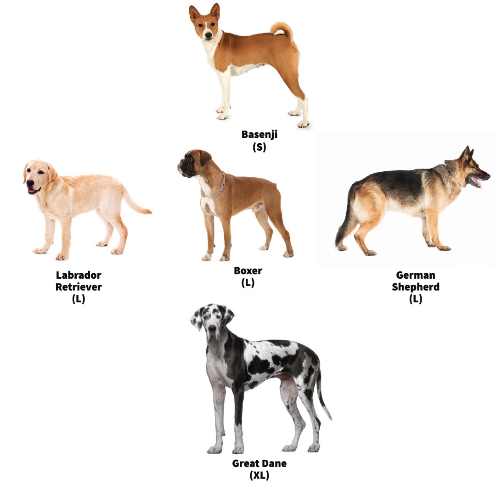

Introduction (40 points)

- 10 points for background on the protein/gene/species of interest and where the data is sourced from


## Introduction

- 10 points for specific, measurable, and clear scientific question

### Scientific Question
When examining dog breeds (canis lupus familiaris), will breeds of a similar size (e.g. Cocker Spaniel, English Cocker Spaniel) have more related genes and SNP's surrounding longevity than breeds of a different size (e.g.Doberman Pinscher,Miniature Pinscher)?

Note: I only selected 6 genes most closely associated with life span (HMGA2 , IGF1 (done) , IGSF1 (too big), IRS4 (too big), LCORL (done),and SMAD2 (too big) ). There are more genes involved in this, but these are the most significant.

Note: Size will be determined by the AKC. You can filter by all AKC recognized dog breeds by size. This is categorical data; if it is easier for me to work with numerical instead, I will instead use the ideal height and weight, as outlined in the official standard of each breed. 

:when possible used regions by paper
if regions too big used dimension of genes on ncbi 

- 10 points for clear, specific, and measurable scientific hypothesis that is in the form of an if-then statement

### Scientific Hypothesis
If you examine canine breeds, then breeds of a similar size (e.g.Cocker Spaniel,English Cocker Spaniel) they will have more related SNPs and or fragments of genes surrounding longevity than breeds of a different size (e.g.Doberman Pinscher,Miniature Pinscher).

- 10 points for description of what analyses were done and how the data was downloaded for the project
## Analysis Performed:
### SNP's 
- EDA: Scatterplots of SNP nucleotide vs size to check for visible trends before analysis
- Multiple Sequence Alignment (of SNP+border sequences), which was then visualized with msaPrettyPrint()
_ Clustering of MSA results, which were visualized as Dendrograms 
### Gene Fragments:
- Multiple Sequence Alignment (of SNP+border sequences), which was then visualized with msaPrettyPrint()
_ Clustering of MSA results, which were visualized as Dendrograms 
### Data Sourcing 
- Dog breed information (sizing): American Kennel Club LINK 
_ Data downloads:
- SNP and gene positionings: 

- 25 points for definition of each of the packages loaded 
- 5 points for correctly loading all of the packages needed
```{r}
#for reading in fasta files
library("BiocManager")
#for reading in excel files
library("readxl")
#for multiple sequence alignment 
library("msa")
#for msa pretty print 
library("tinytex")
#visualization of results 
library("ggplot2")
#for clustering of DNA seqs 
library("DECIPHER")
#for cleaning up dendograms
library('dendextend')
```


```{r, out.width = "200px", echo=F}

```

```{r}
#global variable
alignment_name<<-""

#notebook functions

#align fasta from file_name with names from name file (visualization purposes) after alignment displays msaprettyprint results for human readable data
mult_alingments<-function(file_name,fasta_names,name,big_aln=FALSE,dna_set=TRUE){
  
  #read in fasta for all dogs
  if(dna_set=="TRUE"){
  string_set<-readDNAStringSet(file=file_name,use.names=FALSE)
  }
  else{
      string_set<-readAAStringSet(file=file_name,use.names=FALSE)

  }
  
  #read in seq names as list 
  table=read.table(fasta_names, header = FALSE, sep = "\n")[["V1"]]
  
  #update names for pretty print
  names(string_set)<-table
  
  #align unnamed seqs
  alignment<-msa(string_set,order="input")
  #if seq cant be display with msa pretty print, return
  if(big_aln==TRUE){
    return(alignment)
  }
  #update global variable so multiple pretty print runs dont overrun eachother
  alignment_name<<-gsub(" ", "", paste(name,".pdf"), fixed = TRUE)
  
  #return pretty alignment, does not show up on my console
  msaPrettyPrint(alignment, file=alignment_name,output="pdf",
                 showNames="right",showLogo="top",askForOverwrite=FALSE,
                 showNumbering="none",paperWidth=6,paperHeight=3)
return(alignment_name)
}
#have figure with white background, no gridline and only axis ticks, no lines
tune_figure<-function(fig,addons){
  return(fig+theme_minimal()+theme(
    plot.background = element_blank(),
    panel.grid.major = element_blank(),
    panel.grid.minor = element_blank(),
    panel.border = element_blank()))
}
#create dendogram based on fasta files, names of items clustered in fasta_names
create_dendogram<-function(fasta_path, fasta_names, fig_title){
  #grab DNA info from coallated file
  dna <- string_set<-readDNAStringSet(file=fasta_path,use.names=FALSE)
  #get sequence names
  names(dna)=read.table(fasta_names, header = FALSE, sep = "\n")[["V1"]]
  #create distance matrix for clustering 
  d1 <- DistanceMatrix(dna, type="dist")
  #form dendogram
  dendogram<-IdClusters(d1, method="complete", cutoff=0.05, showPlot=FALSE,type="dendrogram")
  #fix names being cut-off
  nodePar <- list(lab.cex = 0.6, pch = c(NA, 19), 
                cex = 0.7, col = "black")
#plot results 
plot(as.dendrogram(dendogram), ylab = "Height", nodePar =nodePar,main=fig_title)
  return(as.dendrogram(dendogram))
}
```

LCORL Analysis 

```{r}
#LCORL CALL
alignment<-mult_alingments("fasta/LCORL_file.txt","fasta/names.txt","LCORL")
print(alignment_name)
```
```{r, echo=F}
#view pdf
knitr::include_graphics(alignment_name)
```
```{r}
#IGF1 CALL
alignment<-mult_alingments("fasta/igf1.fasta","fasta/igf1_names.txt","igf1")
```


```{r, echo=F}
#view pdf
knitr::include_graphics(alignment_name)
```


```{r}
#visualize size breakdown of dogs
snps<-read_excel("dog snps.xlsx")
#fix ordering of legend
snps$Name <- factor(snps$Name, levels = c("Basenji", "Boxer", "German_Shepherd","Labrador_retriever","Great_Dane"))
p<-ggplot(data = snps, aes(size))+scale_x_discrete(limits = c("S","L","XL"))+geom_bar(aes(fill = Name))+scale_fill_manual(values = c("deepskyblue4","brown2","brown","brown4","darkseagreen4"))
tune_figure(p,add_ons)
```


```{r}
abbrev_x <- c("A","C","'G","'T")
print(length(abbrev_x))
print(length(seq(0,4,by=1)))
#visualize IGF1 SNP by size 
p<-ggplot(data = snps, mapping = aes(y=igf1,x=size_num))+geom_point(size=4,alpha=0.6,color="darkseagreen4")+labs(y="IGF1 Nucleotide", x = "Dog Size")+ggtitle("IGF1 SNP Distribution by Dog Size")
p+geom_jitter(size=4,alpha=0.6,color="darkseagreen4")

```


```{r}
#visualize LCORL SNP by size 
p<-ggplot(data = snps, mapping = aes(y=lcorl,x=size_num))+geom_point(size=4,alpha=0.6,color="darkseagreen4")+ labs(y="LCORL Nucleotide", x = "Dog Size")+ggtitle("LCORL SNP Distribution by Dog Size")
p+geom_jitter(size=4,alpha=0.6,color="darkseagreen4")
```

```{r}
#Cluster LCORL extended fragment 
create_dendogram("fasta/LCORL_file.txt", "fasta/names.txt", "LCORL Extended Fragment Dendogram")
```
http://www.sthda.com/english/wiki/beautiful-dendrogram-visualizations-in-r-5-must-known-methods-unsupervised-machine-learning#plot.dendrogram-function for look and non cut off stuff

```{r}
#Cluster IGF1 extended fragment 
create_dendogram("fasta/igf1.fasta", "fasta/igf1_names.txt", "IGF1 Extended Fragment Dendogram")
```

```{r}
string_set<-readAAStringSet(file="fasta/IGSF1.fasta",use.names=TRUE)
#read in seq names as list 
table=read.table("fasta/IGSF1_names.txt", header = FALSE, sep = "\n")[["V1"]]
#update names for pretty print
names(string_set)<-table
mult<-msa(string_set)
```


```{r}
igsf1<-mult_alingments("fasta/IGSF1.fasta","fasta/IGSF1_names.txt","IGSF1",TRUE,FALSE)
```


```{r}
library(seqinr)
library(ape)
igsf1_aln <- msaConvert(igsf1, type="seqinr::alignment")
d <- dist.alignment(igsf1_aln, "identity")
dendogram<-IdClusters(d, method="complete", cutoff=0.05, showPlot=FALSE,type="dendrogram")
  #fix names being cut-off
  nodePar <- list(lab.cex = 0.6, pch = c(NA, 19), 
                cex = 0.7, col = "black")
#plot results 
plot(as.dendrogram(dendogram), ylab = "Height", nodePar =nodePar,main="igsf1")
  
```
