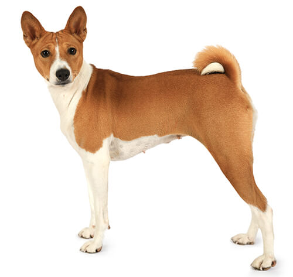
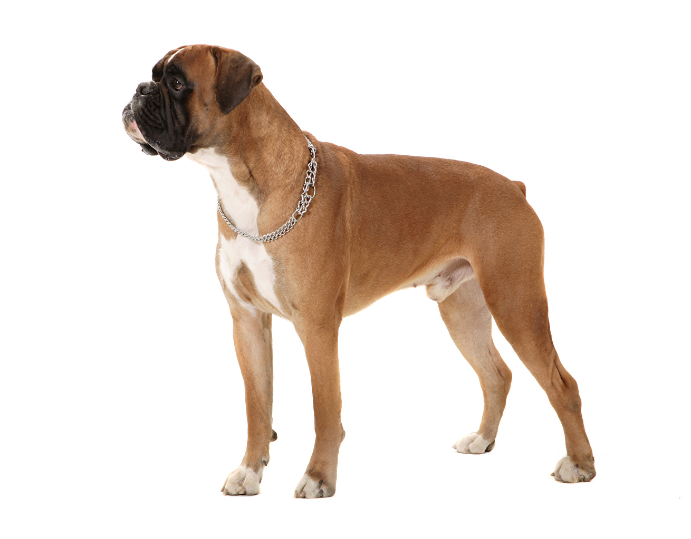
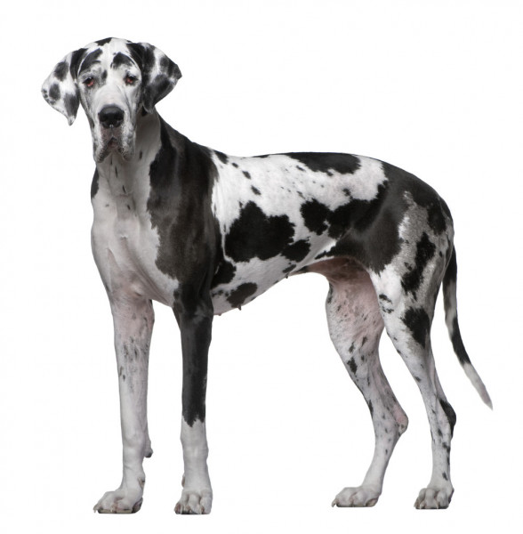
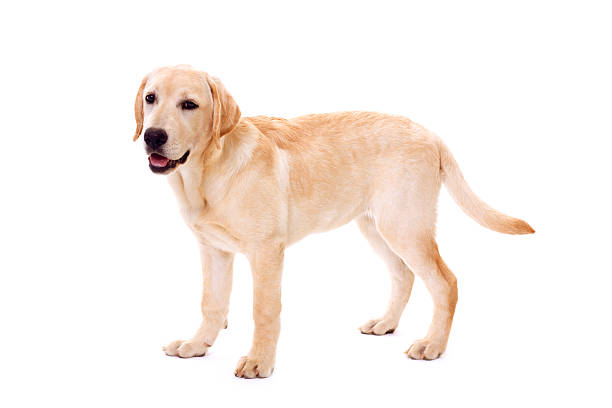
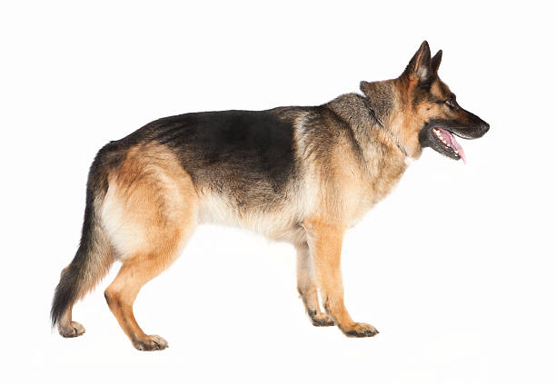

## Introduction
### Scientific Question
When examining canine breeds, will breeds of a similar size (e.g. Cocker Spaniel, English Cocker Spaniel) have more related genes and SNP's surrounding longevity than breeds of a different size (e.g.Doberman Pinscher,Miniature Pinscher)?

Note: I only selected 6 genes most closely associated with life span (HMGA2 , IGF1 , IGSF1, IRS4, LCORL,and SMAD2 ). There are more genes involved in this, but these are the most significant.

Note: Size will be determined by the AKC. You can filter by all AKC recognized dog breeds by size. This is categorical data; if it is easier for me to work with numerical instead, I will instead use the ideal height and weight, as outlined in the official standard of each breed. 

### Scientific Hypothesis
If you examine canine breeds, then breeds of a similar size (e.g.Cocker Spaniel,English Cocker Spaniel) they will have more related SNPs and or fragments of genes surrounding longevity than breeds of a different size (e.g.Doberman Pinscher,Miniature Pinscher).
```{r}
#for reading in fasta files
library("BiocManager")
#for reading in excel files
library("readxl")
#forgot
library("seqinr")
#for multiple sequence alignment 
library("msa")
#for msa pretty print 
library("tinytex")
#visualization of results 
library("ggplot2")
#for clustering of DNA seqs 
library("DECIPHER")
#library("EBImage")
```

```{r, out.width = "100px", fig.cap="Basenji (S)",fig.align="center"}


```
```{r, out.width = "200px", fig.cap="Boxer (L)",fig.align="center"}



```
```{r, out.width = "200px", fig.cap="Great Dane (XL)",fig.align="center"}



``` 
```{r, fig.width=.5, fig.height=7, fig.align="center",fig.cap="Golden Retriever (L)"}



```
```{r, fig.cap="German Shepherd (L)",fig.align="center"}





```


```{r}
#global variable
alignment_name<<-""
#notebook functions

#align fasta from file_name with names from name file (visualization purposes)
#after alignment displays msaprettyprint results for human readable data
mult_alingments<-function(file_name,fasta_names,name){
  
  #read in fasta for all dogs
  string_set<-readDNAStringSet(file=file_name,use.names=FALSE)
  
  #read in seq names as list 
  table=read.table(fasta_names, header = FALSE, sep = "\n")[["V1"]]
  
  #update names for pretty print
  names(string_set)<-table
  
  #align unnamed seqs
  alignment<-msa(string_set,order="input")
  
  #update global variable so multiple pretty print runs dont overrun eachother
  alignment_name<<-gsub(" ", "", paste(name,".pdf"), fixed = TRUE)
  
  #return pretty alignment, does not show up on my console
  msaPrettyPrint(alignment, file=alignment_name,output="pdf",
                 showNames="right",showLogo="top",askForOverwrite=FALSE,
                 showNumbering="none",paperWidth=6,paperHeight=3)
  return(alignment_name)
}
#have figure with white background, no gridline and only axis ticks, no lines
tune_figure<-function(fig,addons){
  return(fig+theme_minimal()+theme(
    plot.background = element_blank(),
    panel.grid.major = element_blank(),
    panel.grid.minor = element_blank(),
    panel.border = element_blank()))
}
#create dendogram based on fasta files, names of items clustered in fasta_names, fig_title is for fig
create_dendogram<-function(fasta_path, fasta_names, fig_title){
  dna <- string_set<-readDNAStringSet(file=fasta_path,use.names=FALSE)
  names(dna)=read.table(fasta_names, header = FALSE, sep = "\n")[["V1"]]
  d1 <- DistanceMatrix(dna, type="dist")
  dendogram<-IdClusters(d1, method="complete", cutoff=0.05, showPlot=FALSE,
                        type="dendrogram")
  nodePar <- list(lab.cex = 0.6, pch = c(NA, 19), 
                cex = 0.7, col = "black")
  plot(as.dendrogram(dendogram), ylab = "Height", nodePar =
         nodePar,main=fig_title)
}
```

LCORL Analysis 

```{r}
#LCORL CALL
alignment<-mult_alingments("fasta/LCORL_file.txt","fasta/names.txt","LCORL")
print(alignment_name)
```
```{r, echo=F}
#view pdf
knitr::include_graphics(alignment_name)
```
```{r}
#IGF1 CALL
alignment<-mult_alingments("fasta/igf1.fasta","fasta/igf1_names.txt","igf1")
```


```{r, echo=F}
#view pdf
knitr::include_graphics(alignment_name)
```


```{r}
#visualize size breakdown of dogs
snps<-read_excel("dog snps.xlsx")
#fix ordering of legend
snps$Name <- factor(snps$Name, levels = c("Basenji", "Boxer", "German_Shepherd","Labrador_retriever","Great_Dane"))
p<-ggplot(data = snps, aes(size))+scale_x_discrete(limits = c("S","L","XL"))+geom_bar(aes(fill = Name))+scale_fill_manual(values = c("deepskyblue4","brown2","brown","brown4","darkseagreen4"))
tune_figure(p,add_ons)
```


```{r}
#visualize IGF1 SNP by size 
p<-ggplot(data = snps, mapping = aes(y=igf1,x=size_num))+geom_point(size=4,alpha=0.6,color="darkseagreen4")
p+geom_jitter(size=4,alpha=0.6,color="darkseagreen4")
```


```{r}
#visualize LCORL SNP by size 
p<-ggplot(data = snps, mapping = aes(y=lcorl,x=size_num))+geom_point(size=4,alpha=0.6,color="darkseagreen4")
p+geom_jitter(size=4,alpha=0.6,color="darkseagreen4")
```

```{r}
#Cluster LCORL extended fragment 
create_dendogram("fasta/LCORL_file.txt", "fasta/names.txt", "LCORL Extended Fragment Dendogram")
```
http://www.sthda.com/english/wiki/beautiful-dendrogram-visualizations-in-r-5-must-known-methods-unsupervised-machine-learning#plot.dendrogram-function for look and non cut off stuff

```{r}
#Cluster IGF1 extended fragment 
create_dendogram("fasta/igf1.fasta", "fasta/igf1_names.txt", "IGF1 Extended Fragment Dendogram")
```

